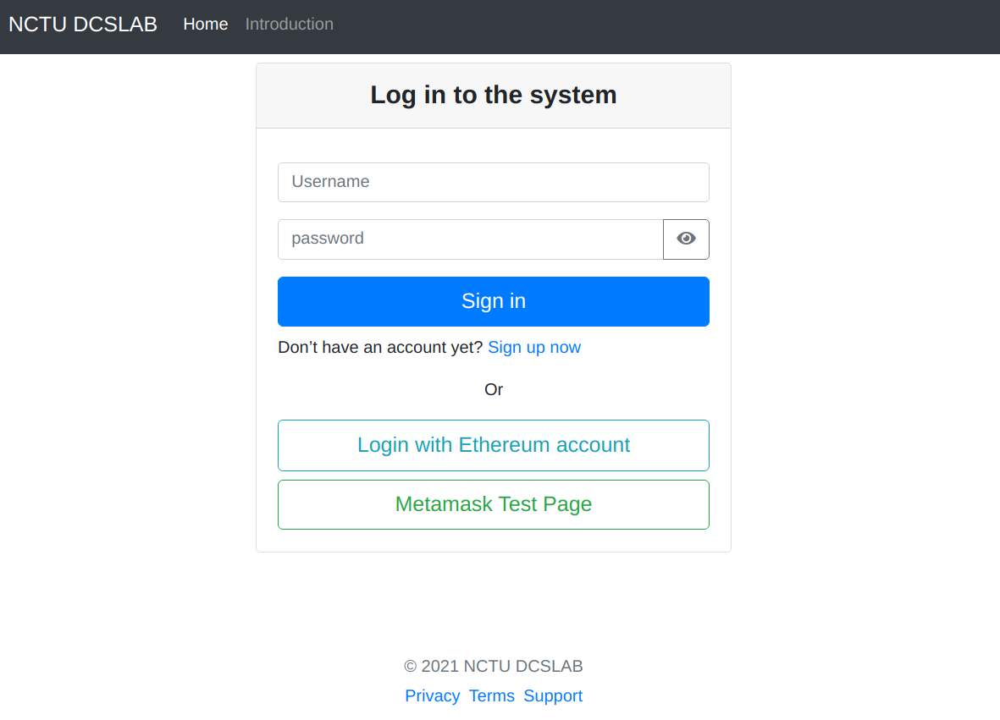
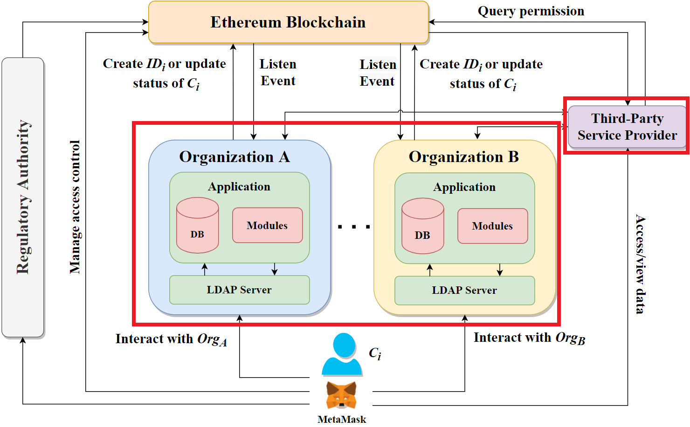
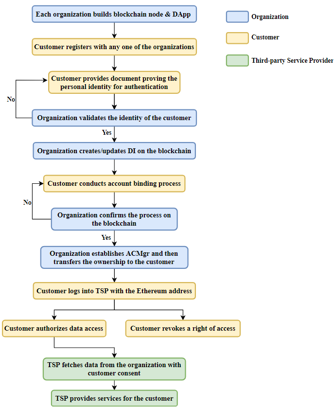

<br />
<p align="center">
  <p align="center">
    Blockchain-based Identification and Access Control Framework - A Case Study of Open Banking Ecosystem
    <br />
    <a href="https://drive.google.com/file/d/1Oy2c6UEhvYYy8UY-V62xqaSsTx5YmXaB/view?usp=sharing"><strong>Explore the full thesis »</strong></a>
    <br />
    <br />
    <a href="#">View Demo</a>
    ·
    <a href="https://github.com/jenhao-thesis/LdapDapp/issues">Report Bug</a>
    ·
    <a href="https://github.com/jenhao-thesis/LdapDapp/issues">Request Feature</a>
  </p>
</p>

<!-- TABLE OF CONTENTS -->
<details open="open">
  <summary>Table of Contents</summary>
  <ol>
    <li>
      <a href="#about-the-project">About The Project</a>
      <ul>
        <li><a href="#built-with">Built With</a></li>
      </ul>
    </li>
    <li>
      <a href="#getting-started">Getting Started</a>
      <ul>
        <li><a href="#prerequisites">Prerequisites</a></li>
        <li><a href="#installation">Installation</a></li>
        <li>
          <a href="#docker">Docker</a>
          <ul>
            <li><a href="#multiple-organizations-folder-structure">Multiple organizations folder structure</a></li>
          </ul>
        </li>
      </ul>
    </li>
    <li><a href="#usage">Usage</a></li>
    <li><a href="#contact">Contact</a></li>
  </ol>
</details>

<!-- ABOUT THE PROJECT -->
## About The Project
<p align="center">
    
</p>

In this thesis, we propose blockchain-based identification and access control framework for Open Banking ecosystem. This framework allows organization administrators to interact with Ethereum nodes for register the digital identity of the customer, and customers also can manage their digital identity and control their data access by calling smart contract functions directly.

In addition, we develop a decentralized application (DApp) to provide the interface for customers to integrate their identities and control data access rights. The DApp we developed has the following features:
* It supports blockchain-based third-party login.
* It provides the Web interface to conduct identity integration processes for customers.
* It enables banks or third-party service providers (TSP) to offer more diverse services and strengthen data sharing.
* It establishes a transparent blockchain environment as well as clear workflows.

As shown in the following figure, the DApp represents applications developed by organizations or TSPs.
<p align="center">
    
</p>


### Built With

* [Node v14.15.1](https://nodejs.org/en/)
* [Web3.js v1.3.0](https://github.com/ChainSafe/web3.js?source=post_page-----70de1c0c035c----------------------)
* [Express 4.9.0](https://www.npmjs.com/package/express/v/4.9.0)
* [Redis v=4.0.9](https://www.1ju.org/redis/redis-quick-guide)
* [OpenLDAP](https://www.techrepublic.com/article/how-to-install-openldap-on-ubuntu-18-04/)
* [Truffle v5.1.57](https://www.trufflesuite.com/docs/truffle/testing/writing-tests-in-solidity) or [Remix - Ethereum IDE](https://remix.ethereum.org/)
* [Solidity v0.5.16](https://docs.soliditylang.org/en/v0.5.16/genindex.html)

## Getting Started
Before getting started, you should build [the blockchain environment](https://github.com/jenhao-thesis/ethereum-docker-poa) (e.g., Ethereum nodes) and setup [the LDAP server](https://github.com/jenhao-thesis/LdapServer).
### Prerequisites

* node
  ```sh
  apt install nodejs
  node -v
  ```

* npm 
  ```sh
  apt install npm
  npm -v
  ```

* truffle
After compiling contracts, you will get `build` folder including contract `.json` files. And get the contract address (OMgr) when migration complete.
  ```sh
  npm install -g truffle

  truffle init
  truffle compile
  truffle migrate --reset
  ```
  PS. If it is failed, just update the `node` version to `14.15.1`.
* (optional) Remix
If you don't have `truffle` toolkit, you also can compile your contract code by online IDE, e.g., [Remix](https://remix.ethereum.org/).

* Redis
  ```sh
  apt-get install redis-server
  ```
  Next is to enable Redis to start on system boot. Also restart Redis service once.
  ```sh
  sudo systemctl enable redis-server.service
  ```
* (optional) browserify
  If you don't use web3 provided by browser (older version), you should install `browserify` for compile packages. The `Browserify` lets you use require in the browser, the same way you'd use it in Node​.
  ```sh
  npm install -g browserify
  ```

### Installation
1. Clone the repo
    ```sh 
    git clone https://github.com/jenhao-thesis/LdapDapp.git
    ```
2. Install NPM packages
    ```sh
    npm install
    ```
3. Setup configuration ([server-config.json](https://github.com/jenhao-thesis/LdapDapp/blob/main/server-config-example.json))
    ```sh
    cp server-config-example.json server-config.json
    ```

    For example:
    ```json
    {
        "ldap": {
            "server": {
                "url": "ldap://[ip:port]",
                "bindDN": "[bindDN]",
                "bindCredentials": "[bindCredentials]",
                "searchBase": "[searchBase]",
                "searchFilter": "[searchFilter]"
            },
            "usernameField": "username",
            "passwordField": "password"
        },
        "redis": {
            "host": "[ip]",
            "port": "[port]"
        },
        "contracts": {
            "organizationManagerAddress": "[contract address]",
            "accessManagerAddress": ""
        },
        "admin_address": "[administrator address]",
        "admin_key": "[administrator private key]",
        "web3_provider": "ws://[ip:port]",
        "org_mapping": {
            "[address of organization A(upper case only)]": ["[ip:port]", "[organization name for display on website]"],
            "[address of organization B(upper case only)]": ["[ip:port]", "[organization name for display on website]"],
            "[address of organization C(upper case only)]": ["[ip:port]", "[organization name for display on website]"],
            "[address of organization D(upper case only)]": ["[ip:port]", "[organization name for display on website]"],
            "[address of organization E(upper case only)]": ["[ip:port]", "[organization name for display on website]"]
        }
    }
    ```

4. Enter your the contract address (<em>OMgr</em>) in `server-config.json`.

5. (optional) Convert `web3_init.js` to `web3_bundle.js`
    ```sh
    browserify web3_init.js -o web3_bundle.js
    ```

6. Launch Dapp.
    ```sh
    npm start
    ```
### Docker
In addition to installation the complete project, we also write a docker-compose file that builds and runs multi-container Docker applications. With it, we can easier create, deploy, and run our all applications by using containers. 

When we build and run 3 organizations follows five steps. 
1. Create directorys for 3 organizations.
    ```sh
    mkdir orgA
    mkdir orgB
    mkdir orgC
    ```
2. Clone two repos in each directory separately.
    ```sh
    git clone https://github.com/jenhao-thesis/LdapDapp.git
    git clone from https://github.com/jenhao-thesis/LdapServer.git
    ```
3. Copy `docker-compose.yml` from `LdapDapp` folder.
    ```sh
    cp orgA/LDapp/docker-compose.yml orgA/
    cp orgB/LDapp/docker-compose.yml orgB/
    cp orgC/LDapp/docker-compose.yml orgC/
    ```

4. Setup `server-config.json` in each directory separately.
5. Start all Docker Containers in each directory separately.
    ```sh
    cd orgA/
    docker-compose up -d

    cd orgB/
    docker-compose up -d

    cd orgC/
    docker-compose up -d    
    ```


#### Multiple organizations folder structure
    .
    ├── orgA
    │   ├── docker-compose.yml
    │   ├── LdapDapp                    # git clone https://github.com/jenhao-thesis/LdapDapp.git
    │   │   ├── server-config.json      # Server configuration
    │   │   ├── build                   # 1) truffle compile, generate contracts json file. or 2) compile contracts via Remix
    │   │   │   └── contracts
    │   │   │       ├── AccessManager.json
    │   │   │       └── OrganizationManager.json
    |   |   └── ...
    │   └── LdapServer                  # git clone from https://github.com/jenhao-thesis/LdapServer.git
    ├── orgB
    └── orgC

PS. `server-config.json` should be set hostname as follows.
```json
"host": "redis",
"web3_provider": "ws://ganache:8545",
"url": "ldap://ldap_server:1389",
```

## Usage
The following figure demonstrates how the DApp can be used.

<p align="center">
    
</p>

<!-- CONTACT -->
## Contact

Jen-Hao Cheng - jenhao.cs08g@nctu.edu.tw, jenhao.cs08@nycu.edu.tw